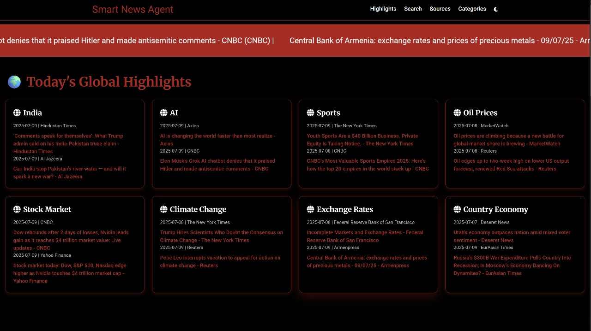

# RSS-News-Aggregator-with-Llama3

**AI News Summarizer** is a serverless Flask web application that leverages Groq's LLaMA-3 model to provide intelligent, topic-wise news aggregation and summarization using real-time data from Google News RSS feeds. It integrates intelligent filtering logic for regions, publishers, and timeframes, and presents categorized summaries alongside user-driven custom query support.

---

## Project Overview

This application is built to address the modern need for rapid and contextual understanding of news. It combines fast RSS feed parsing, intelligent source filtering, and LLM-driven summarization, creating a complete lightweight news intelligence engine that works entirely through serverless architecture.

At its core, the app fetches news from Google News RSS based on user-selected criteria such as:

- Region-specific feeds (mapped via ISO codes and country indicators)
- Publisher-level filtering (with normalization via known source name variations)
- Date-range filtering using parsed timestamps from RSS
- Keyword/topic search from user input

Once articles are fetched and filtered, they are passed to the Groq API with a structured prompt for summarization. The summaries are concise, informative, and follow a fixed multi-line style for clarity.

---

## Key Features

### 🧠 AI-Powered Summarization
Summarization is handled via Groq’s hosted `llama3-70b-8192` model using structured prompts and caching. This ensures fast, consistent summaries even for repeated requests.

### 📰 Relevance-First News Filtering
Includes a robust logic system for:
- Filtering by country (via TLDs, publisher name, and domain keywords)
- Recognizing more than 100 major global publishers using normalization heuristics
- Filtering articles by publish date using precise datetime matching
- Limiting and ordering news items for prioritization and display

### 🔍 Multi-Dimensional Query Support
Users can:
- Search by topic or keyword
- Select specific publishers or news regions
- Narrow down results by timeframe (Today, Yesterday, Last 2 Days, etc.)
- Ask follow-up questions after summarization, with contextual LLM-based answers

### 📊 Intelligent Headline Categorization
The homepage showcases top headlines categorized into themes like:
- AI & Technology
- Finance & Business
- Health & Politics
- Climate & Environment
- Sports & Defence

Each category generates a unified summary using multiple topic-specific RSS pulls.

---

## Technical Architecture

- **Backend Framework**: Flask (Python)
- **RSS Parsing**: `feedparser`
- **Summarization Model**: Groq `llama3-70b-8192` (accessed via REST API)
- **Rendering Engine**: Jinja2 templates (`render_template`)
- **UI Layers**: HTML + CSS with support for dynamic forms and POST-driven logic
- **Caching**: In-memory summarization cache (avoids repeated Groq API calls)
- **Filtering Intelligence**:
  - Region matching via domain/TLD/substring logic
  - Publisher normalization via dictionary mappings
  - Date validation using parsed `published_parsed` from RSS

---

## Core Files

- `app.py`: Main Flask application with all routing, logic, and summarization
- `vercel.json`: Configuration for deploying on Vercel using `@vercel/python`
- `requirements.txt`: Slim dependency list (`Flask`, `feedparser`, `requests`)
- `templates/index.html`: Frontend Jinja template with forms and news layout
- `static/`: Contains optional CSS/JS for styling (not mandatory for logic)

---

## Summary

AI News Summarizer is designed as a fully functional and modular intelligent news dashboard. It combines real-time RSS feeds, robust country/source filtering, and high-quality LLM summaries — creating a platform that bridges raw data with intelligent synthesis. Fully deployable serverlessly and structured for extensibility, this project stands as a strong demonstration of applied LLM integration for media monitoring and analysis.

